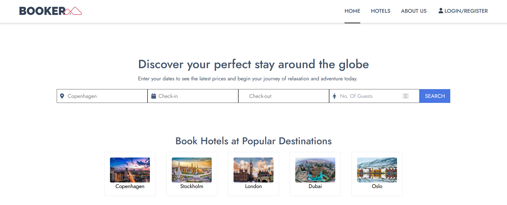

# Booker Hotel Booking v3

Booker: A cutting-edge hotel booking platform crafted using modern web technologies. This fully responsive web application seamlessly connects travelers with their ideal accommodations.

<a href="#" align="center">
  <picture>
    <source media="(prefers-color-scheme: dark)" srcset="readme.png">
    
  </picture>
</a>

### Preview
[DEMO 🏨](#)


## Key Features

- **Responsive Design**: The entire interface is fully responsive, meticulously designed with Tailwind CSS.
- **Cutting-Edge Tech Stack**: Developed using React, Tailwind CSS, MirageJS (for API mocking), and Cypress (for end-to-end testing).
- **Enhanced User Experience**: Incorporates skeleton loading screens to improve user experience during data retrieval.
- **Production-Ready**: Meticulously crafted to meet production standards and requirements.
- **Future Backend Integration**: Future plans include integrating with an Express.js backend.
- **Comprehensive Test Coverage**: Comprehensive test coverage using Cypress ensures reliable functionality.


## Getting Started

These instructions will get you a copy of the project up and running on your local machine for development and testing purposes.

### Prerequisites

- Node.js
- npm or yarn

### Installing

1. Clone the repository:

   ```bash
   git clone ####
   ```

2. Navigate to the project directory:

   ```bash
   cd booker
   ```

3. Install dependencies:

   ```bash
   npm install
   # or
   yarn install
   ```

4. Start the development server:

   ```bash
   npm start
   # or
   yarn start
   ```

The application should now be running on [http://localhost:3000](http://localhost:3000).

## Running the Tests

To ensure the reliability and stability of the application, comprehensive test suites have been written using Cypress.

To run the tests:

```bash
npm test
# or
npx cypress open
```


