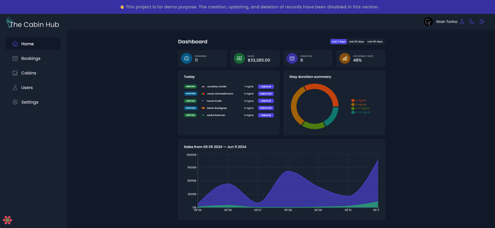

<a align="center" href="https://the-cabin-hub.vercel.app/" target="_blank"></a>
  <hr>
<h3 align="center">The hotel's internal management system empowers employees to oversee all aspects of hotel bookings, accommodations, and guest services.</h3>

<h4 align="center">
    <a href="#">View Demo</a>
  <span> · </span>
    <a href="#features">Features</a>
  <span> · </span>
    <a href="#tech-stack">Tech Stack</a>
  <span> · </span>
    <a href="#installation">Installation</a>
</h4>

<a align="center" href="https://the-cabin-hub.vercel.app/" target="_blank" ></a>

## Features

1. **User Authentication and Signup:**

   1. Hotel employees can access the application to perform their duties.
   2. To prevent unauthorized access, the application restricts new user sign-ups to verified hotel employees only.

2. **User Profile Management:**

   1. Users can customize their profile by adding an avatar.
   2. Users can update their name and password.

3. **Cabin Management:**

   1. The app displays a table view that lists all available cabins.
   2. The table view presents key cabin details, such as the photo, name, capacity, price, and any current discounts.
   3. Users have the ability to modify or remove existing cabins.
   4. Users can create new cabins and upload photos to accompany them.

4. **Booking Management:**

   1. The app displays all bookings in a tabular format.
   2. The table view presents key booking details, such as arrival and departure dates, booking status, paid amount, cabin specifications, and guest information.
   3. A booking's status can have one of three states: "unconfirmed," "checked in," or "checked out."
   4. Users can filter the table view based on the booking status.

5. **Booking Operations:**

   1. As a guest arrives, users can delete the booking, check the guest in, or check the guest out.
   2. Users can accept payments outside the app and then confirm the transactions within the app during the check-in process.
   3. Guests who have not already done so can add breakfast for the duration of their stay when checking in.


6. **Dashboard:**

   1. The app's main screen functions as a dashboard, presenting key data from the past 7, 30, or 90 days.
   2. The dashboard displays a list of guests checking in and out on the current day, allowing users to perform tasks related to these check-in and check-out activities.
   3. Rewritten sentence: The dashboard displays up-to-date statistics on bookings, sales, check-ins, and occupancy levels.
   4. The chart displays the hotel's daily sales, separating "total" revenue from "extras" revenue, which currently consists only of breakfast sales.
   5. There's also a chart displaying statistics on stay durations, an important metric for the hotel.

7. **Application-wide Settings:**

   1. Users can configure various application-wide settings, including the price of breakfast, the minimum and maximum number of nights per booking, and the maximum number of guests per booking.

8. **Dark Mode:**
   1. The app offers a dark mode that provides a visually distinct and more comfortable user experience in low-light environments.

## Tech Stack

- React
- Supabase
- React Query
- React Hot Toast
- Recharts
- React Router
- React Hook Form
- Vite
- Phosphor Icons

## Installation

- Clone the repository:

  ```
  git clone https://github.com/jkalbasri/the-cabin-hub.git
  ```

- Navigate to the project directory:

  ```
  cd the-cabin-hub
  ```

- Install the dependencies:

  ```
  npm install
  ```

- Set up the environment variables:

  1.  Duplicate `.env.example` file into `.env`

  2.  Add the <b>supabase URL</b> and <b>key</b>

## <a align="center" href="http://albasri.dk/"> AA</a>
